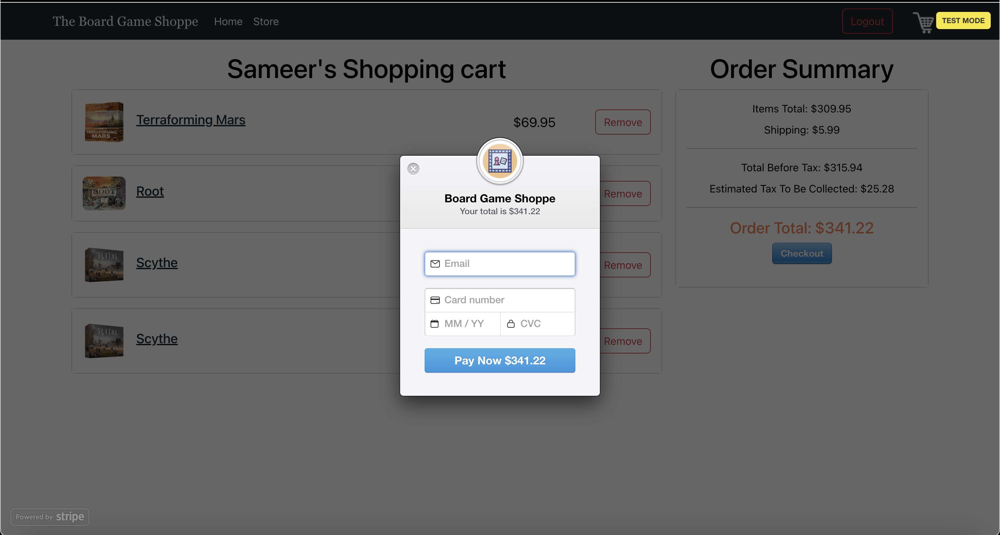

# Board Game Shoppe
> An e-Commerce website dedicated to offering quality board games for competitive prices!

## Table of Contents
* [General Info](#general-information)
* [Technologies Used](#technologies-used)
* [Features](#features)
* [Screenshots](#screenshots)
* [Setup](#setup)
* [Usage](#usage)
* [Project Status](#project-status)
* [Room for Improvement](#room-for-improvement)
* [Acknowledgements](#acknowledgements)
* [Contact](#contact)
<!-- * [License](#license) -->

## General Information
- This website was a very enjoyable group project that culminated into a fully fledged online board game store. It features a large inventory of popular board games, and some that you didn't know exist. Although not accepting payments at the moment, the user can log in and purchase their favorite games using our payment processing system powered by Stripe. Unfortunately, the Board Game Atlas API has been deprecated.

## Technologies Used
- Languages: Java, JavaScript
- Frameworks: Spring MVC, React
- Styling: Bootstrap, CSS
- Databases: MySQL
- APIs: Stripe, Board Game Atlas (deprecated)

## Features
Ready features:
- Store page with "Add-to-Cart" and game detail functionality. 
- Login and Registration to protect customer cart information and safeguard payment portal. Complete with validations.
- Stripe componenent to process credit card payments (not accepting payments at the moment but the feature is live).
- Filtering by category and search-by-keyword options are also available to enhance shopping experience. 

## Screen Shots

## Usage
This website is customizable and scalable. 

## Project Status
Project is complete! Still, we are always open to feedback and more than willing to add more features. 

## Acknowledgements
Many thanks to Kevin Moore and Mandvi Alreja for collaborating and turning this concept into reality!
